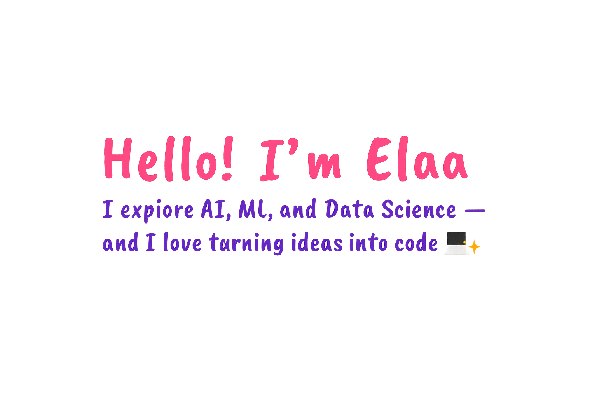

  

🎓 3rd Year Computer Engineering Student @ Sakarya University of Applied Sciences 🤖 Exploring the world of Artificial Intelligence, Machine Learning & Data Science 🧪 Turning curiosity into code — one model, one dataset at a time 🐍 Python lover | 📊 Data-driven thinker | 🚀 Always building, always learning  ☁️ Currently learning about cloud concepts and Microsoft Azure Fundamentals 

# 💻 Tech Stack:
                   
# 📊 GitHub Stats:
 
<!-- Proudly created with GPRM ( https://gprm.itsvg.in ) -->
